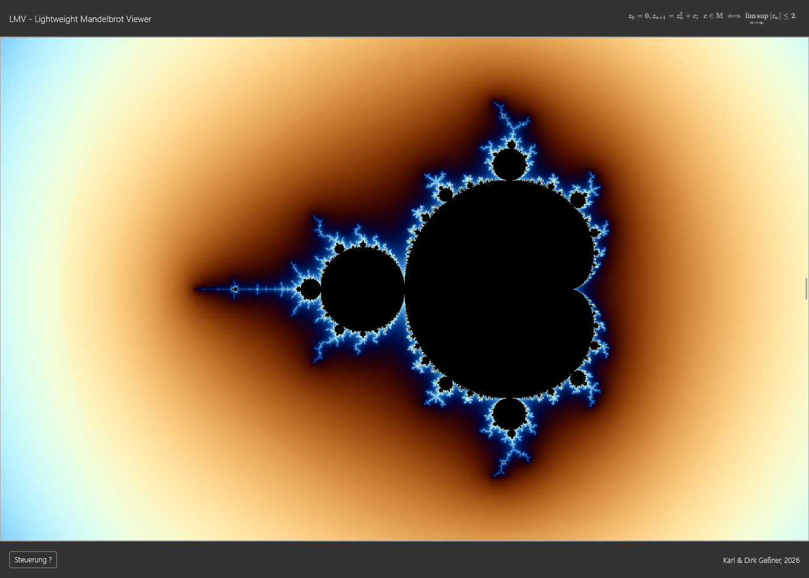
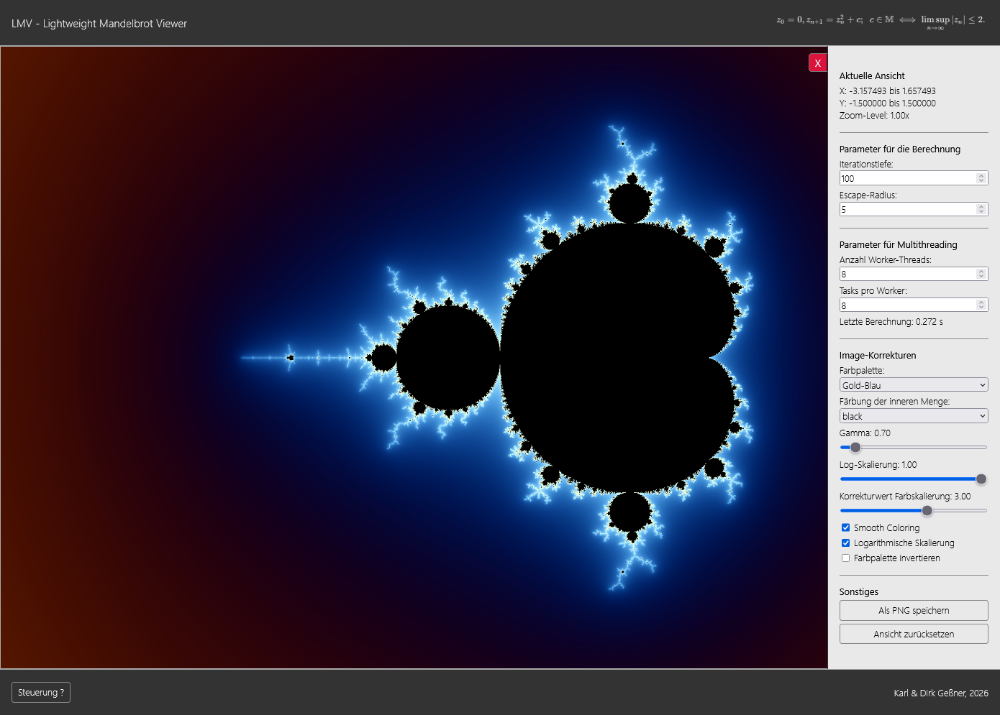
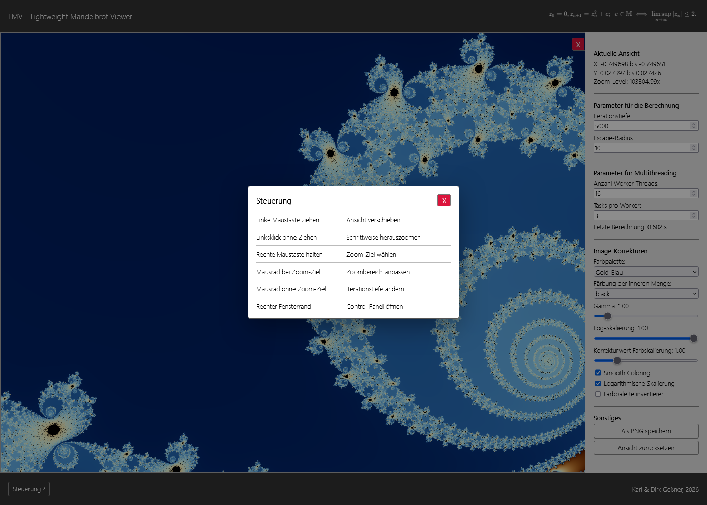
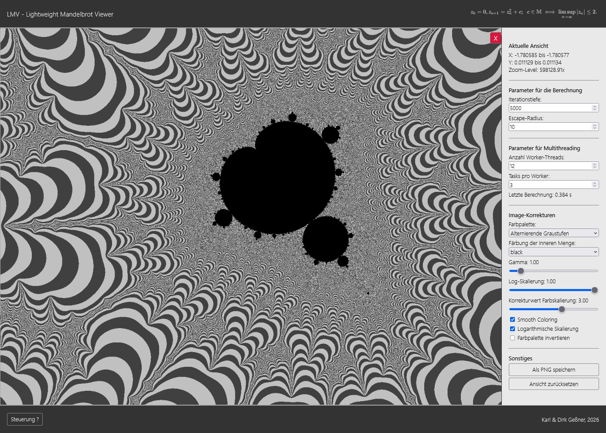
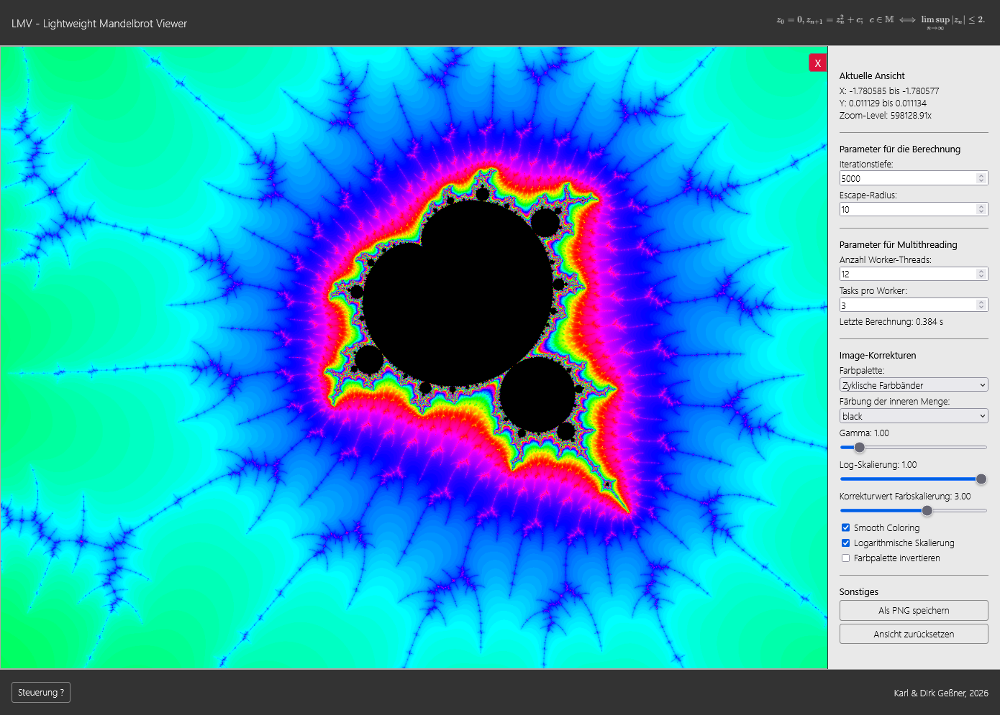
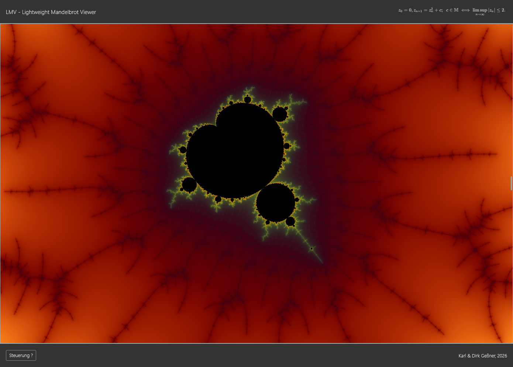
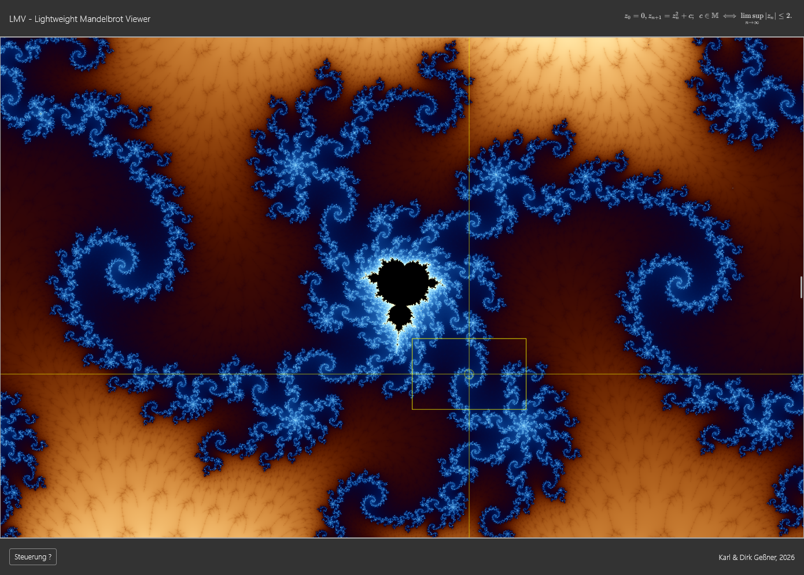
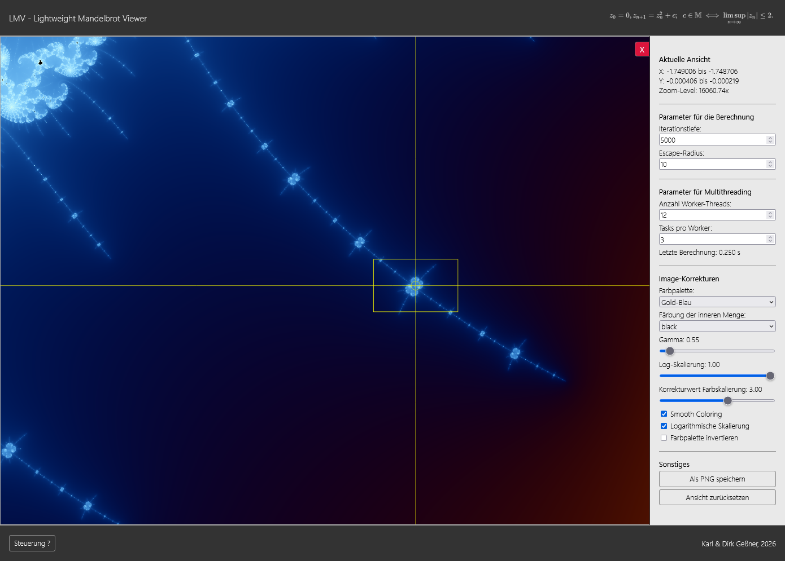
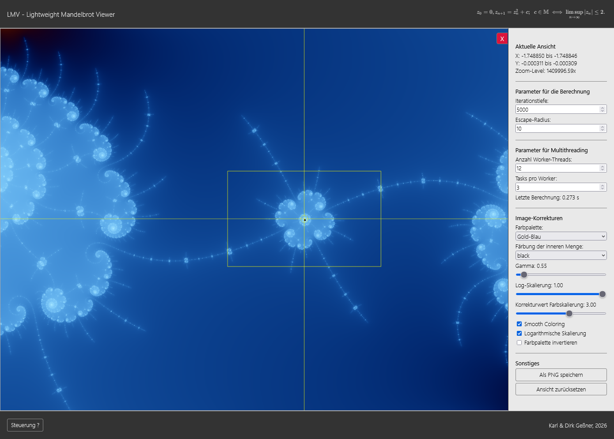
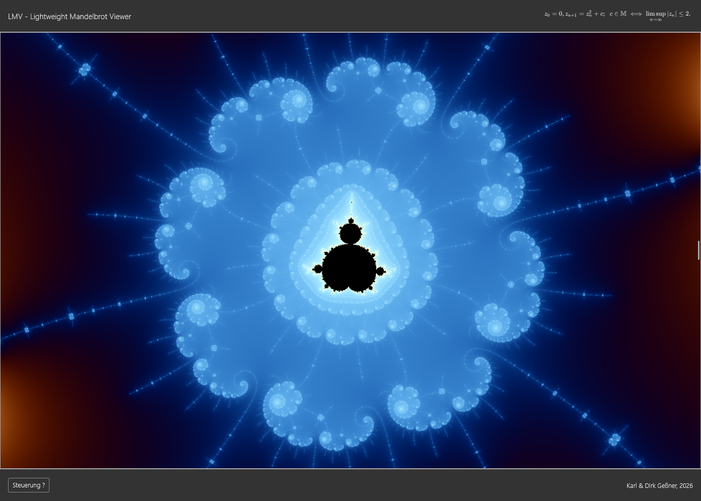

# LMV – Lightweight Mandelbrot Viewer

LMV ist ein interaktiver Mandelbrot-Viewer für den Webbrowser. Die Anwendung stellt die Mandelbrot-Menge auf einem HTML5-Canvas dar und erlaubt es, den Ausschnitt, die Berechnungsparameter und die Farbgebung interaktiv zu verändern.

Das Projekt ist bewusst leichtgewichtig gehalten: Es gibt keine Build-Pipeline, keinen Bundler und kein Framework-Setup. Die Anwendung kann direkt über einen lokalen Webserver in einem modernen Browser gestartet werden.

---

## Benutzer-Dokumentation

### Worum handelt es sich bei dem Projekt?

LMV ist ein Lern- und Experimentierprojekt zur Mandelbrot-Menge. Der Viewer berechnet die Mandelbrot-Daten im Browser und erzeugt daraus ein farbig gerendertes Canvas-Bild.

Die Anwendung eignet sich zum Erkunden der Mandelbrot-Menge, zum Experimentieren mit Zoomstufen, Iterationstiefe und Farbpaletten sowie zum Speichern interessanter Ansichten als PNG-Datei.

Die Berechnung kann je nach Ansicht über ein WebGPU-Backend oder über das CPU-Backend mit Web Workern erfolgen. Für Ansichten, bei denen die aktuelle WebGPU-Implementierung wegen `f32`-Präzision nicht mehr sinnvoll eingesetzt werden kann, fällt die Anwendung auf die CPU-Berechnung zurück.

### Hauptfunktionen

- Interaktive Darstellung der Mandelbrot-Menge im Browser.
- Zoom in frei wählbare Bildbereiche.
- Verschieben des sichtbaren Ausschnitts per Maus.
- Änderung der Iterationstiefe direkt über das Mausrad.
- Anpassung der Darstellung über ein Control-Panel.
- Auswahl verschiedener Farbpaletten.
- Steuerung von Gamma-Korrektur, logarithmischer Skalierung, Smooth Coloring und Paletteninvertierung.
- Anzeige der aktuellen X- und Y-Bereiche sowie des Zoom-Levels.
- Berechnung der `IterationData` automatisiert über WebGPU oder CPU-Worker.
- Automatischer CPU-Fallback für zu tiefe Zoomstufen oder WebGPU-Fehler.
- Speichern der aktuellen Ansicht als PNG.
- Zurücksetzen auf den initialen Bildausschnitt.

### Inbetriebnahme

1. Repository klonen oder als ZIP-Datei herunterladen.
2. Projektverzeichnis öffnen.
3. Einen lokalen Webserver im Projektverzeichnis starten, zum Beispiel über die Live-Server-Erweiterung des Editors oder einen einfachen lokalen HTTP-Server.
4. `index.html` im Browser öffnen.

Ein lokaler Webserver ist erforderlich, weil Web Worker und Modul-Worker in modernen Browsern nicht zuverlässig direkt aus `file://`-URLs geladen werden.

Der Viewer lädt Vue 3 über CDN:

```html
https://unpkg.com/vue@3/dist/vue.global.prod.js
```

Eine lokale Installation oder ein Build-Schritt ist aktuell nicht nötig.

Für das WebGPU-Backend wird ein Browser mit WebGPU-Unterstützung benötigt. Ist WebGPU nicht verfügbar oder für die aktuelle Ansicht nicht geeignet, wird die Berechnung über das CPU-Backend ausgeführt.

### Verwendung der Benutzeroberfläche

#### Canvas

Der große zentrale Bereich zeigt die Mandelbrot-Menge. Dort finden die wichtigsten Interaktionen statt: Zoomen, Verschieben und Ändern der Iterationstiefe.

| Aktion | Bedienung |
|---|---|
| Ansicht verschieben | Linke Maustaste auf dem Canvas gedrückt halten und ziehen |
| Zoom-Out | Linke Maustaste klicken, ohne zu ziehen |
| Zoom-In | Rechte Maustaste drücken, Auswahlrahmen positionieren, optional mit Mausrad skalieren, dann loslassen |
| Auswahlrahmen positionieren | Rechte Maustaste gedrückt halten und Maus bewegen |
| Iterationstiefe ändern | Mausrad über dem Canvas verwenden, solange keine Zoom-Auswahl aktiv ist |

#### Control-Panel

Das Control-Panel befindet sich als Overlay-Drawer am rechten Fensterrand.

| Aktion | Bedienung |
|---|---|
| Control-Panel öffnen | Maus an den rechten Fensterrand bewegen |
| Control-Panel schließen | Close-Button links neben dem geöffneten Control-Panel klicken |
| PNG speichern | Im Control-Panel unter „Sonstiges“ den Button „Als PNG speichern“ verwenden |
| Ansicht zurücksetzen | Im Control-Panel unter „Sonstiges“ den Button „Ansicht zurücksetzen“ verwenden |

Das Control-Panel zeigt die aktuelle Ansicht und erlaubt die direkte Änderung von Berechnungs-, Multithreading- und Darstellungsparametern.

Angezeigt werden:

- X-Bereich,
- Y-Bereich,
- Zoom-Level.

Berechnungsparameter:

- Iterationstiefe,
- Escape-Radius.

Multithreading-Parameter:

- Anzahl Worker-Threads,
- Tasks pro Worker,
- Rechenzeit der letzten vollständigen `IterationData`-Aktualisierung in Sekunden.

Darstellungsparameter:

- Farbpalette,
- Farbe der inneren Menge,
- Gamma-Korrektur,
- Log-Skalierung,
- Korrekturwert für die Farbskalierung,
- Smooth Coloring ein/aus,
- logarithmische Skalierung ein/aus,
- Farbpalette invertieren.

Sonstige Funktionen:

- aktuelle Ansicht als PNG speichern,
- Ansicht auf den initialen Ausschnitt zurücksetzen.

### Farbpaletten

Aktuell sind mehrere Palettentypen vorhanden.

Cosinus-Paletten:

- `Gold-Blau`,
- `Feuer`,
- `Eis`,
- `Party`.

Graustufen-Paletten:

- `Graustufen`,
- `Alternierende Graustufen`.

Weitere Paletten:

- `HSV-Regenbogen`,
- `Zyklische Farbbänder`.

Für die innere Menge stehen mehrere feste Farben zur Verfügung:

- Schwarz,
- Weiß,
- Magenta,
- Cyan,
- Gelb.

### Screenshots












---

## Entwickler-Dokumentation

### Projektstruktur

```text
.
├── index.html
├── css/
│   ├── styles.css
│   └── modules/
│       ├── controls.css
│       ├── modal.css
│       └── ...
├── img/
│   ├── lmv.png
│   ├── definition.svg
│   └── screenshots/
│       └── ...
└── js/
    ├── core/
    │   └── worker-rpc-client.js
    ├── webgpu/
    │   └── webgpu-worker-runtime.js
    ├── fractals/
    │   ├── fractal-gpu-utils.js
    │   └── mandelbrot/
    │       ├── mandelbrot.js
    │       ├── mandelbrot-cpu-worker.js
    │       ├── mandelbrot-webgpu.js
    │       └── mandelbrot-webgpu-worker.js
    ├── dom.js
    ├── settings.js
    ├── timing.js
    ├── palettes.js
    ├── iteration-data.js
    ├── rendering.js
    ├── layout.js
    ├── interactions.js
    ├── ui.js
    ├── file.js
    └── main.js
```

### Wichtige Dateien

- `index.html` enthält Seitenstruktur, Canvas, Render-Overlay, Control-Drawer, Vue-gebundene Controls und die Script-Einbindung.
- `css/styles.css` bindet die CSS-Module ein.
- `css/modules/controls.css` enthält das Styling und die Animationen für den Control-Drawer und den Close-Button.
- `css/modules/modal.css` enthält das Styling des Help-Modals.
- `img/definition.svg` wird im Header als Formelgrafik eingebunden.
- `js/dom.js` sammelt zentrale DOM-Referenzen wie Canvas, Context, Wrapper, Render-Overlay und Control-Drawer.
- `js/settings.js` enthält Berechnungs-, Rendering- und Multithreading-Einstellungen.
- `js/timing.js` enthält die Laufzeitmessung für vollständige Iterationsdaten-Aktualisierungen.
- `js/palettes.js` definiert Farben und Farbpaletten.
- `js/iteration-data.js` enthält generische Operationen auf Iterationsdaten, darunter Kopieren von Rechtecken, Dirty-Rect-Ermittlung, Panning- und Resize-Logik.
- `js/core/worker-rpc-client.js` enthält einen Promise-basierten RPC-Client für Worker-Kommunikation mit Request-IDs und Pending-Request-Verwaltung.
- `js/webgpu/webgpu-worker-runtime.js` enthält wiederverwendbare WebGPU-Worker-Hilfsfunktionen, darunter Kontext- und Pipeline-Initialisierung sowie Fehlerantworten.
- `js/fractals/fractal-gpu-utils.js` enthält GPU-nahe Hilfsfunktionen, die nicht direkt Mandelbrot-spezifisch sind, zum Beispiel Float32-Splitting und den Aufbau von `IterationData` aus GPU-Arrays.
- `js/fractals/mandelbrot/mandelbrot.js` enthält die Mandelbrot-spezifische Orchestrierung, Backend-Auswahl, CPU-Worker-Aufrufe, Task-Aufteilung und das Zusammenführen der Teilergebnisse.
- `js/fractals/mandelbrot/mandelbrot-cpu-worker.js` enthält die synchrone Mandelbrot-Berechnung für das CPU-Backend.
- `js/fractals/mandelbrot/mandelbrot-webgpu.js` enthält den Main-Thread-Proxy zum Mandelbrot-WebGPU-Worker.
- `js/fractals/mandelbrot/mandelbrot-webgpu-worker.js` enthält die WebGPU-Compute-Berechnung der Mandelbrot-Iterations- und Escape-Werte.
- `js/rendering.js` enthält Rendering-Funktionen, den Aufbau von `ImageData` aus Iterationsdaten, Bildausgabe, Render-Overlay und Panning-Vorschau.
- `js/layout.js` behandelt Canvas-Größe, initialen View, Seitenverhältnis, Resize-Logik und Reset der Ansicht.
- `js/interactions.js` enthält Mausinteraktion, Panning, Zoom-Auswahl, Zoom-Out-Schritte, Mausradsteuerung und das Zeichnen des Auswahlrahmens mit Fadenkreuz.
- `js/ui.js` enthält die Vue-App für das Control-Panel und synchronisiert UI-State mit den Settings.
- `js/file.js` enthält den PNG-Export des aktuellen Canvas.
- `js/main.js` initialisiert Canvas, View, Control-Drawer, UI-Info und startet die erste Berechnung.

### Technische Details

#### Trennung von Berechnung, Iterationsdaten und Rendering

Die Anwendung trennt drei Ebenen:

1. **Berechnung**
   - Die Mandelbrot-Menge wird für den aktuell sichtbaren View berechnet.
   - Ergebnis sind Iterationswerte und Escape-Werte.
   - Die Berechnung kann über WebGPU oder CPU-Worker erfolgen.

2. **Iterationsdaten**
   - Die Werte werden in einer Matrix gehalten.
   - Die Datenstruktur ist allgemeiner gedacht als die konkrete Mandelbrot-Berechnung.
   - Operationen wie Kopieren, Verschieben und Dirty-Rect-Ermittlung hängen nicht direkt von der Mandelbrot-Formel ab.

3. **Rendering**
   - Aus den Iterationsdaten wird ein `ImageData`-Objekt erzeugt.
   - Render-Parameter wie Palette, Gamma, Smooth Coloring, logarithmische Skalierung und Paletteninvertierung werden erst beim Bildaufbau angewendet.
   - Das fertige `ImageData` wird auf den Canvas gezeichnet.

Diese Trennung erlaubt schnelle Aktualisierungen bei reinen Darstellungsänderungen: Farb- und Rendering-Parameter bauen nur das Bild aus den vorhandenen Iterationsdaten neu auf. Eine vollständige Neuberechnung ist nur nötig, wenn sich Berechnungsparameter oder der sichtbare mathematische Ausschnitt ändern.

#### IterationData

Die zentrale Datenstruktur enthält:

```js
{
  width,         // Breite der Matrix in Pixeln
  height,        // Höhe der Matrix in Pixeln
  iterations,    // Uint16Array(width * height)
  escapeValues,  // Float32Array(width * height)
  minIterations  // kleinster Iterationswert im Datensatz
}
```

`iterations` und `escapeValues` sind parallel aufgebaut. Der Index eines Pixels ergibt sich aus:

```text
index = y * width + x
```

#### Backend-Auswahl

Die zentrale Einstiegstelle ist die Rechteckberechnung:

```text
computeMandelbrotRect(rect, imageWidth, imageHeight, computationSettings)
```

Diese Funktion entscheidet zwischen WebGPU-Backend und CPU-Backend.

Das WebGPU-Backend wird verwendet, wenn:

- `USE_WEBGPU_BACKEND` aktiv ist,
- WebGPU im Browser verfügbar ist,
- die Ansicht nicht zu tief für die aktuelle `f32`-GPU-Berechnung ist.

Wenn WebGPU fehlschlägt oder die aktuelle Ansicht wegen `f32`-Präzision nicht geeignet ist, wird direkt der CPU-Pfad verwendet. Dadurch nutzt der Fallback weiterhin die vorhandene parallele CPU-Berechnung und fällt nicht auf eine einzelne Worker-Instanz zurück.

#### CPU-basierte Berechnung

Für kleine Rechtecke oder eine Worker-Anzahl von `1` wird ein einzelner CPU-Worker verwendet. Für größere Rechtecke wird das Rechteck horizontal in mehrere Tasks geteilt.

Diese Tasks werden mit einem einfachen Worker-Pool abgearbeitet. Konfigurierbar sind:

- Anzahl der Worker-Threads,
- Anzahl der Tasks pro Worker.

Die Aufteilung folgt dem Prinzip:

```text
taskCount = min(rect.height, workerCount * tasksPerWorker)
```

Dadurch entstehen in der Regel mehr Tasks als Worker. Das verbessert die Lastverteilung, weil die Rechenzeit innerhalb der Mandelbrot-Menge stark vom Bildbereich abhängt.

Der Ablauf für eine parallele vollständige CPU-Neuberechnung ist:

1. Aktuelles Bildrechteck bestimmen.
2. Rechteck horizontal in mehrere Tasks zerlegen.
3. Tasks in fester Reihenfolge in eine Queue legen.
4. Mehrere CPU-Worker starten.
5. Jeder Worker verarbeitet nacheinander den jeweils nächsten freien Task.
6. Ergebnisse in Task-Reihenfolge ablegen.
7. Teilergebnisse in ein gemeinsames `IterationData`-Objekt kopieren.
8. Aus `IterationData` ein neues `ImageData` erzeugen.
9. Canvas neu zeichnen.

Die CPU-Worker selbst kennen keine Parallelisierungslogik. Sie berechnen nur ein einzelnes übergebenes Rechteck und liefern dessen Iterations- und Escape-Werte zurück.

#### WebGPU-basierte Berechnung

Das WebGPU-Backend verwendet einen dauerhaft wiederverwendeten Worker:

```text
mandelbrot.js
  -> mandelbrot-webgpu.js
       -> mandelbrot-webgpu-worker.js
```

`mandelbrot-webgpu.js` arbeitet als Main-Thread-Proxy. Es verwaltet die Worker-Instanz, Request-IDs und ausstehende Promises.

`mandelbrot-webgpu-worker.js` initialisiert den WebGPU-Kontext und die Compute-Pipeline. Die GPU-Berechnung erzeugt:

- einen `iterations`-Buffer,
- einen `escapeValues`-Buffer.

Beide Buffer werden nach dem Dispatch zurückgelesen und in eine `IterationData`-Struktur übertragen.

Die WebGPU-Berechnung arbeitet im Shader mit `f32`. Zur Verbesserung der Koordinatenberechnung werden die View-Koordinaten center-relativ aufgebaut. Der Mittelpunkt wird in High-/Low-Float32-Anteile zerlegt. Dadurch wird der Koordinatenaufbau stabiler als bei direkter Berechnung aus `minX`/`maxX`, echte Double-Precision im Mandelbrot-Loop wird dadurch aber nicht ersetzt.

Für tiefe Zoomstufen wird deshalb auf das CPU-Backend zurückgefallen.

#### WebGPU-Dispatch

Der Compute-Shader arbeitet mit zweidimensionalen Workgroups. Die Anwendung protokolliert optional:

- Workgroup-Größe,
- Anzahl der Workgroups,
- angeforderte Shader-Invocations,
- tatsächlich aktive Pixel,
- inaktive Rand-Invocations.

Diese Werte beschreiben die angeforderten Shader-Invocations. Die tatsächliche Anzahl physischer GPU-Threads wird von WebGPU abstrahiert und ist nicht zuverlässig auslesbar.

#### Laufzeitmessung

Für vollständige Neuberechnungen wird die letzte `IterationData`-Aktualisierung gemessen. Die Messung umfasst die Berechnung der neuen Iterationsdaten inklusive Backend-Aufwand, Worker-Verteilung, GPU-Readback und Zusammenführung der Teilergebnisse.

Nicht gemessen werden reine Render-Änderungen wie Farbpalette, Gamma oder Log-Skalierung, weil diese keine neue Iterationsmatrix erzeugen und deshalb schlecht mit vollständigen Neuberechnungen vergleichbar sind.

Der zuletzt gemessene Wert wird im Control-Panel im Bereich „Parameter für Multithreading“ in Sekunden mit drei Nachkommastellen angezeigt.

#### Panning mit Dirty Rects

Beim Verschieben der Ansicht wird während der Mausbewegung zunächst nur das bereits gerenderte Bild verschoben dargestellt. Dadurch fühlt sich das Panning unmittelbar an.

Beim Loslassen der Maustaste passiert Folgendes:

1. Der mathematische View wird um die Pixelverschiebung in Koordinaten verschoben.
2. Die vorhandene Iterationsmatrix wird in eine neue Matrix kopiert.
3. Der weiterhin sichtbare Bereich wird aus dem alten Cache übernommen.
4. Die neu sichtbar gewordenen Randbereiche werden als Dirty Rects bestimmt.
5. Nur diese Dirty Rects werden neu berechnet.
6. Anschließend wird aus der aktualisierten Iterationsmatrix ein neues `ImageData` erzeugt.

Bei einer kleinen horizontalen Verschiebung wird zum Beispiel nur ein vertikaler Randstreifen neu berechnet. Bei einer kombinierten horizontalen und vertikalen Verschiebung entstehen ein Randstreifen und ein zusätzlicher oberer oder unterer Streifen.

Wenn die Verschiebung größer oder gleich der Bildgröße ist, wird das gesamte Bild neu berechnet.

#### Resize mit Dirty Rects

Bei Größenänderungen des Fensters wird das Canvas an die tatsächliche Anzeigengröße angepasst. Der mathematische View wird so erweitert, dass das neue Seitenverhältnis ohne Verzerrung erfüllt wird.

Canvas-Vergrößerungen werden schrittweise behandelt:

1. Breitenänderungen werden horizontal verarbeitet.
2. Höhenänderungen werden vertikal verarbeitet.
3. Bereits vorhandene Daten werden an die passende Position im neuen Datenraster kopiert.
4. Nur die neu entstandenen Randbereiche werden berechnet.
5. Der zurückgegebene View wird zusammen mit den erzeugten Iterationsdaten übernommen.

Bei Canvas-Verkleinerungen wird aktuell vollständig neu berechnet. Das ist einfacher und vermeidet komplizierte Ausschnitts- und Resampling-Fälle.

#### Smooth Coloring und Farbskalierung

Für Punkte außerhalb der Mandelbrot-Menge kann Smooth Coloring aktiviert werden. Dabei wird der Farbwert nicht nur aus der ganzzahligen Iterationszahl gebildet, sondern mit dem Escape-Wert geglättet.

Zusätzlich unterstützt die Darstellung:

- lineare Skalierung,
- logarithmische Skalierung,
- Mischung zwischen linearer und logarithmischer Skalierung über `logStrength`,
- Gamma-Korrektur,
- Farbskalierungs-Korrektur,
- Paletteninvertierung.

Für Cosinus-Paletten wird folgende Funktion verwendet:

```text
color = a + b * cos(2π * (c * t + d))
```

#### Mandelbrot-Optimierungen

Für sicher innenliegende Punkte werden schnelle Vorabtests genutzt:

- Periode-2-Glühbirne,
- Hauptkardiode.

Punkte, die durch diese Tests sicher innerhalb der Menge liegen, müssen nicht vollständig iteriert werden.

### Entwicklungsnotizen

#### Warum Web Worker?

Die Mandelbrot-Berechnung ist rechenintensiv. Durch Web Worker kann sie aus dem Hauptthread ausgelagert werden. Im CPU-Backend wird dadurch außerdem eine parallele Berechnung über mehrere Worker ermöglicht.

Die Architektur ist darauf ausgelegt, dass die aufrufenden Schichten weiterhin mit einer vollständigen `IterationData`-Struktur arbeiten, während die Backend-Details innerhalb der Berechnungsschicht gekapselt bleiben.

#### Warum WebGPU?

Die Berechnung einzelner Mandelbrot-Pixel ist hochgradig parallelisierbar. WebGPU erlaubt es, viele Pixel gleichzeitig über einen Compute-Shader zu berechnen. In der aktuellen Umsetzung werden sowohl die Iterationswerte als auch die Escape-Werte auf der GPU berechnet und anschließend als Typed Arrays zurück in die bestehende `IterationData`-Pipeline übertragen.

#### Warum CPU-Fallback?

Die aktuelle WebGPU-Implementierung arbeitet mit `f32`. Das ist für viele normale Ansichten schnell und ausreichend genau, stößt bei tieferen Zoomstufen aber an Präzisionsgrenzen. Für solche Fälle wird auf das CPU-Backend zurückgefallen, das weiterhin mit JavaScript-`number` und der vorhandenen parallelen Worker-Aufteilung arbeitet.

#### Warum mehr Tasks als Worker?

Die Rechenzeit ist über das Bild ungleich verteilt. Bereiche nahe der Grenze der Mandelbrot-Menge benötigen häufig deutlich mehr Iterationen als andere Bereiche.

Wenn das Bild nur in so viele Teile zerlegt wird, wie Worker vorhanden sind, kann ein einzelner langsamer Teilbereich die Gesamtdauer dominieren. Mehr kleinere Tasks verbessern die Lastverteilung: Worker, die mit einem schnellen Task fertig sind, können weitere Tasks übernehmen.

#### Warum Dirty Rects?

Ohne Dirty Rects müsste bei jeder Verschiebung oder Vergrößerung des Canvas das gesamte Bild neu berechnet werden. Das ist besonders bei hoher Iterationstiefe teuer.

Dirty Rects reduzieren die Arbeit auf die Bereiche, für die noch keine gültigen Iterationsdaten vorhanden sind. Das verbessert insbesondere:

- Panning über kleine Distanzen,
- Vergrößerung des Browserfensters,
- Layoutänderungen, bei denen bereits sichtbare Bereiche erhalten bleiben.

### Grenzen der aktuellen Lösung

- Die CPU-Worker werden aktuell pro Task über die bestehende Worker-Aufruffunktion erzeugt und nach Abschluss beendet; ein dauerhaft wiederverwendeter CPU-Worker-Pool wäre ein möglicher nächster Optimierungsschritt.
- Die Teilergebnisse werden beim Transfer noch nicht konsequent mit Transferables optimiert.
- Die WebGPU-Berechnung arbeitet aktuell mit `f32`; für tiefe Zoomstufen ist deshalb ein CPU-Fallback erforderlich.
- Die center-relative Koordinatenberechnung verbessert die WebGPU-Präzision, ersetzt aber keine echte Double-Precision-Arithmetik im Shader.
- Verkleinerungen des Canvas werden vollständig neu berechnet.
- Es gibt noch keine Touch- oder Tastatursteuerung.
- Es gibt noch keine Persistenz für Bookmarks, Presets oder Zoom-Historie.
- Die Multithreading-Parameter sind manuell einstellbar; eine automatische Wahl anhand von `navigator.hardwareConcurrency` wäre denkbar.

### Lernziele

- Grundlagen von HTML5 Canvas und Pixel-Rendering.
- Mathematische Struktur der Mandelbrot-Menge.
- Trennung von Berechnung, Iterationsdaten, `ImageData` und Canvas-Ausgabe.
- Auslagerung rechenintensiver Arbeit in Web Worker.
- Zerlegung großer Rechenbereiche in kleinere Tasks.
- Einfache Worker-Pool- beziehungsweise Task-Queue-Strategien.
- Nutzung von WebGPU Compute Shadern für pixelweise parallele Berechnungen.
- Aufbau und Readback von GPU-Buffern.
- Umgang mit `f32`-Präzisionsgrenzen in GPU-Shadern.
- Wiederverwendung berechneter Daten beim Verschieben der Ansicht.
- Dirty-Rect-Strategien für Panning und Resize.
- Strukturierung eines einfachen JavaScript-Projekts in kleinere Module.
- Umgang mit interaktivem UI-State.
- Responsive Layouts ohne Verzerrung mathematischer Koordinaten.
- Experimentieren mit Farbpaletten, Smooth Coloring und logarithmischer Skalierung.
- Vorbereitung einer generischeren Fraktal-Pipeline, zum Beispiel für spätere Julia-Mengen.

### Mögliche nächste Schritte

- CPU-Worker wiederverwenden statt für jeden Task neu erzeugen.
- Typed-Array-Buffer mit Transferables übertragen, um Kopieraufwand zu reduzieren.
- Automatische Worker-Anzahl aus `navigator.hardwareConcurrency` ableiten.
- Task-Größe dynamisch an Bildgröße und Iterationstiefe anpassen.
- WebGPU-/CPU-Vergleichstests für kleine Referenzbereiche ergänzen.
- WebGPU-Backend in der Benutzeroberfläche auswählbar machen, zum Beispiel `Auto`, `CPU`, `WebGPU`.
- Die `f32`-Grenze für den WebGPU-Fallback empirisch justieren.
- Experimentell Double-Single-Arithmetik oder Perturbation-Methoden für tiefere GPU-Zoomstufen prüfen.
- Robustere Merge-Logik für beliebige Teilrechtecke ergänzen.
- Touch- und Tastaturbedienung verbessern.
- Presets, Bookmarks oder eine Zoom-History einbauen.
- Frei editierbare Palettenparameter ergänzen.
- Export-Metadaten ergänzen, zum Beispiel View-Koordinaten oder Rendering-Parameter.
- Canvas-Verkleinerungen ebenfalls cache-basiert behandeln, sofern sich daraus ein klarer Nutzen ergibt.
- Weitere Entkopplung der generischen Iterationsdaten-Operationen von der konkreten Mandelbrot-Berechnung.
- Perspektivisch Julia-Mengen oder andere Escape-Time-Fraktale ergänzen.

---

Entwickelt als gemeinsames Lernprojekt von Karl und Dirk Geßner.
